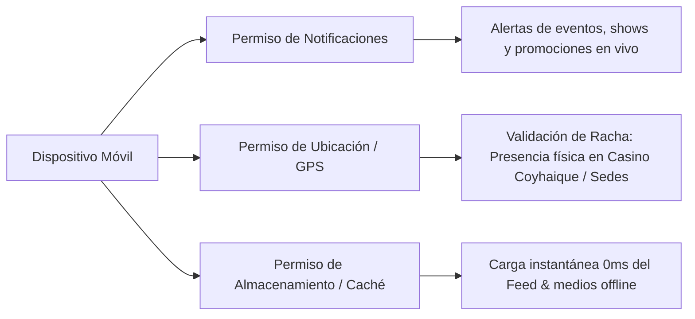
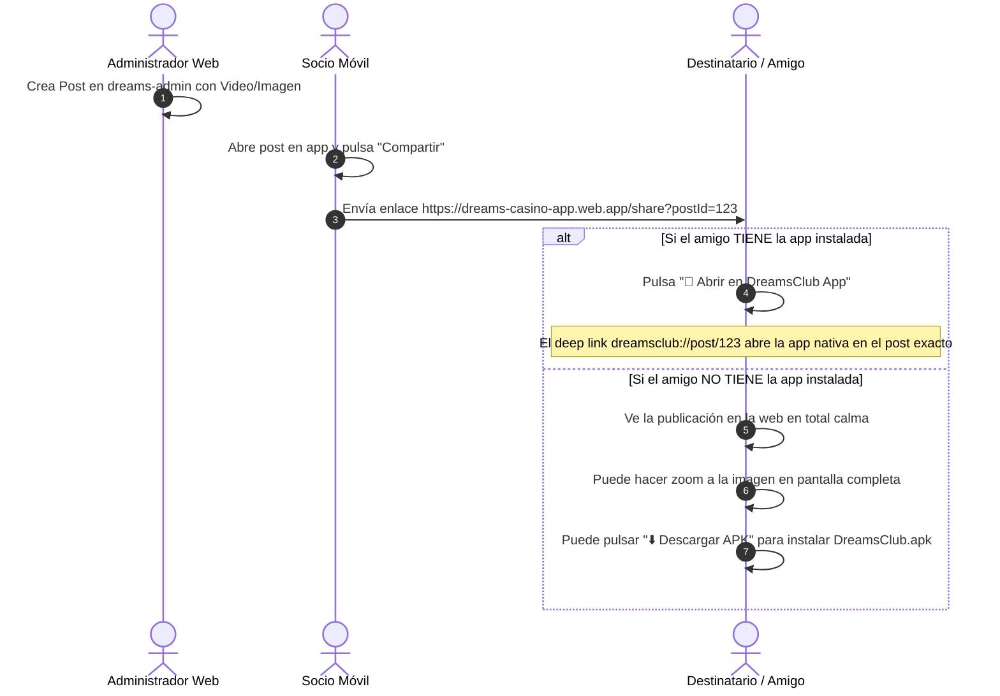
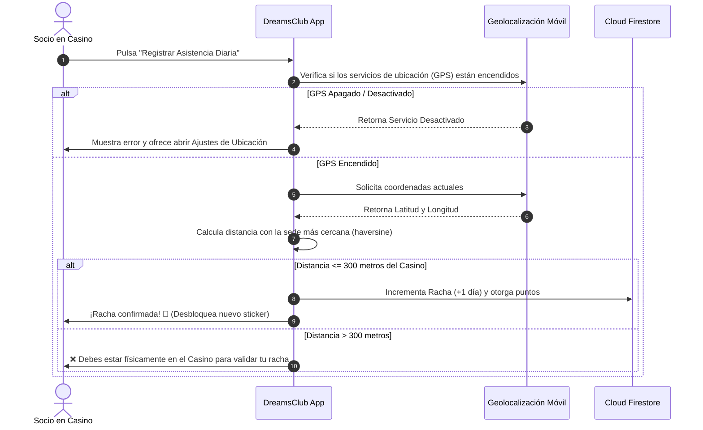

# 🎰 DreamsClub: Especificación Técnica y Funcional del Ecosistema

> **Documento de Evaluación y Auditoría de Software**  
> **Versión:** 1.2.0 • **Fecha:** Agosto 2026  
> **Ecosistema:** Panel Web de Administración (Astro + Tailwind + Firebase) & App Móvil (Flutter + Riverpod + Firebase)

---

## 📌 1. Visión General del Proyecto

**DreamsClub** es la plataforma integral de fidelización, gamificación y entretenimiento de la cadena **Casinos Dreams** (con presencia en 8 sedes en Chile). El ecosistema se compone de:

1. **Dreams Admin (Panel Web):** Plataforma web administrativa construida en Astro para la gestión centralizada de contenidos, usuarios, juegos, stickers de WhatsApp, analíticas y notificaciones en tiempo real.
2. **DreamsClub App (Móvil):** Aplicación nativa multiplataforma (Android/iOS) en Flutter orientada al cliente/socio para consumo de cartelera, minijuegos, recompensas de asistencia presencial por GPS, stickers y comunidad.

```mermaid
graph TD
    subgraph Servidor & Nube [Firebase & Cloud Services]
        Auth[Firebase Auth]
        DB[(Cloud Firestore)]
        Storage[(Firebase Hosting & Drive)]
        FCM[Firebase Cloud Messaging]
    end

    subgraph Panel Web [Dreams Admin - Astro Web]
        Dashboard[Dashboard & Métricas]
        FeedAdmin[Gestor de Feed & Posts]
        GamesAdmin[Control de 4 Minijuegos]
        StickersAdmin[Packs de Stickers & Rachas]
        UsersAdmin[Gestión de Socios & Puntos]
        ShareWeb[Página Web Compartir & Preview]
    end

    subgraph App Móvil [DreamsClub App - Flutter]
        FeedApp[Feed Social Multimedia]
        GamesApp[Ruleta, Slots, Trivia, Raspa]
        RachasApp[Check-in GPS & Logros]
        CasinosApp[8 Sedes & Rutas Google Maps]
        ProfileApp[Drawer, Dreams Pay & Biometría]
    end

    Dashboard --> DB
    FeedAdmin --> DB
    GamesAdmin --> DB
    StickersAdmin --> DB
    UsersAdmin --> DB
    ShareWeb --> DB

    FeedApp --> DB
    GamesApp --> DB
    RachasApp --> DB
    CasinosApp --> DB
    ProfileApp --> Auth
```



---

## 🌐 2. Plataforma Web: Dreams Admin (`dreams-admin`)

El panel de administración es el centro de control exclusivo para los administradores y operadores de Casinos Dreams. **La creación y edición de contenidos es 100% exclusiva de este panel.**

### 2.1. Módulos y Funcionalidades

| Módulo | Estado Actual | Descripción y Comportamiento Esperado |
| :--- | :---: | :--- |
| **1. Dashboard Central** | ✅ Operativo | Muestra métricas clave en tiempo real: socios activos, juegos habilitados, puntos/créditos entregados y actividad reciente del feed. Accesos directos para *Nuevo Post*, *Enviar Notificación* y *Configurar Juegos*. |
| **2. Feed & Publicaciones** | ✅ Operativo | Creación de posts multimedia (videos e imágenes). Soporta bypass de procesamiento de Google Drive (`uc?export=download`) y previsualizaciones locales. Categorización por tipo: **Noticia**, **Promoción** o **Evento**, y asignación por sede (`casinoId: '1'` a `'8'`). |
| **3. Notificaciones Push & In-App** | ✅ Operativo | Envío de alertas masivas o segmentadas por casino con disparador directo a Firebase Cloud Messaging y registro en Firestore para el buzón in-app. |
| **4. Gestor de Stickers** | ✅ Operativo | Creador de packs de stickers de WhatsApp. Permite definir qué nivel de racha o tipo de socio (*Bronce, Plata, Oro, Black*) desbloquea cada pack o meme. |
| **5. Control de 4 Minijuegos** | ✅ Operativo | Interruptores de activación/desactivación individual y configuración de probabilidades/créditos: <br>1. *Ruleta Diaria*<br>2. *Trivia Dreams*<br>3. *Tragamonedas / Slot VIP*<br>4. *Raspa y Gana* |
| **6. Gestión de Usuarios** | ✅ Operativo | Listado de socios registrados, balance de puntos, historial de visitas/rachas, edición de nivel de membresía y bloqueo/desbloqueo de cuentas. |
| **7. Página Pública de Compartir (`/share`)** | ✅ Operativo | Página web optimizada para Open Graph (WhatsApp/Twitter/Facebook) con render dinámico del post, reproductor de video nativo, modal de zoom en imágenes en pantalla completa y enlaces limpios sin redirecciones automáticas invasivas. |
| **8. Centro de Descargas (`/download`)** | ✅ Operativo | Landing page oficial para descarga directa del APK Android (`DreamsClub.apk`) sin extensiones zip ni bloqueos de planes gratuitos. |

---

## 📱 3. Aplicación Móvil: DreamsClub App (`casinoloyalty_flutter`)

La aplicación móvil está orientada al consumo ágil, visualmente atractiva (Dark Theme de lujo con acentos dorados y púrpuras) y de alto rendimiento.

### 3.1. Requerimientos de Permisos del Dispositivo



1. **Permiso de Notificaciones (`POST_NOTIFICATIONS`):**
   * *Propósito:* Recibir avisos en tiempo real sobre espectáculos en vivo, giros de ruleta disponibles y promociones flash de sala.
2. **Permiso de Ubicación Precisa (`ACCESS_FINE_LOCATION`):**
   * *Propósito:* **Geocercas de Racha.** El usuario **solo** puede acumular días de racha y desbloquear logros presenciales si el GPS valida que se encuentra físicamente dentro del radio geográfico de la sede del casino (ej. Dreams Coyhaique: `-45.57081, -72.07419`).
3. **Caché Local Inteligente:**
   * *Propósito:* Persistencia local mediante `SharedPreferences` y prefetching de imágenes/videos para renderizado instantáneo del feed en $0\text{ ms}$, con protección `!isFromCache` para evitar parpadeos.

---

### 3.2. Navegación Principal (Barra Inferior de 4 Pestañas)

```
┌─────────────────────────────────────────────────────────────┐
│ 🏠 Inicio (Feed) │ 🎰 Juegos │ 🏆 Logros │ 📍 Casinos        │
└─────────────────────────────────────────────────────────────┘
```

#### 1. 🏠 Inicio (Feed Social)
* **Formato:** Scroll vertical inmersivo estilo Reels/TikTok/Shorts con fondo oscuro puro (`Colors.black`).
* **Visualización de Pantalla Completa (Inmersiva):** El reproductor multimedia y las imágenes ocupan el 100% del fondo de pantalla en videos verticales. En videos horizontales, se auto-ajustan en ancho completo y centrado, quedando los controles e información flotando en capas superiores.
* **AppBar e Interfaz Translúcida:** Los botones de Menú Lateral (Drawer) y Notificaciones (Buzón/Campana), junto con el título principal "DREAMS SOCIAL", flotan de forma transparente en el área superior de la pantalla con sombras sutiles para contraste.
* **Overlays de Control y Contenidos:**
  * **Barra Lateral de Acciones (Derecha):** Columna vertical flotante que contiene el botón de Reacciones (corazón o Lottie con contador), comentarios (contador), compartir nativo (contador), enlaces ("Ver") y herramientas de moderación. Incluye una animación continua de disco de vinilo rotatorio para simular pista de audio activa.
  * **Información del Post (Izquierda):** Avatar, nombre de autor con etiqueta "Socio Dreams", título y descripción (con gradiente inferior oscuro para asegurar 100% de legibilidad).
  * **Acceso Rápido a Comentarios:** Barra inferior flotante ("Agrega un comentario...") que abre el panel de comentarios en 1 toque.
* **Bottom Sheet Modular de Comentarios (Visualización Simultánea):** Al abrir la billetera de comentarios, el Bottom Sheet se expande limitadamente al 70% de la pantalla. El 30% superior permanece libre y traslúcido, lo que permite al usuario seguir reproduciendo el video o contemplando la imagen de fondo de forma continua e ininterrumpida mientras comenta, chatea o envía stickers y GIFs.

#### 2. 🎰 Juegos (Centro de Minijuegos)
* Acceso directo a los 4 juegos habilitados por la administración web:
  1. **Ruleta Diaria:** 1 giro gratis cada 24 horas para ganar créditos Dreams o multiplicar puntos.
  2. **Trivia Dreams:** Preguntas de cultura general y eventos de la región con límite de tiempo.
  3. **Slot Machine / Tragamonedas VIP:** Animación de rodillos para combinaciones de símbolos clásicos de casino.
  4. **Raspa y Gana:** Interfaz táctil interactiva para descubrir premios ocultos.

#### 3. 🏆 Logros (Rachas & Misiones)
* **Contador de Racha Presencial:** Registro de visitas consecutivas al casino validado por GPS.
* **Misiones Semanales:** Tareas lúdicas (ej. "Visita el casino un viernes", "Prueba tu suerte en la ruleta 3 días seguidos").
* **Desbloqueo de Stickers:** Al subir de nivel en la racha, se habilitan automáticamente paquetes de stickers exclusivos que se pueden exportar a WhatsApp con un solo toque (`whatsapp_stickers_plus`).

#### 4. 📍 Casinos (Nuestras 8 Sedes)
* Listado interactivo de toda la cadena nacional con fotos, descripción, horarios y servicios (Restaurantes, Spa, Gran Arena, Hotel 5 estrellas).
* **Integración Precisa de Google Maps:** Al presionar el botón de ruta, la app busca a Google Maps por el **nombre comercial oficial exacto** (ej. `"Dreams Monticello"`, `"Dreams Coyhaique"`), garantizando que el mapa abra la ficha oficial del negocio con sus reseñas y ruta, sin confundir ubicaciones.

---

### 3.3. Menú Lateral Desplegable (Drawer de Usuario)

Accesible desde el botón de menú superior en la pantalla principal:

```
┌───────────────────────────────────────────────┐
│ 👤 PERFIL DE SOCIO                            │
│ Juan Pérez • Socio Nivel Oro 👑                │
│ Puntos Acumulados: 12.450 pts                 │
├───────────────────────────────────────────────┤
│ 🏆 Mis Logros & Recompensas                   │
│ 💎 Beneficios VIP & Descuentos en Sala        │
│ 📍 Nuestros 8 Casinos                         │
│ 💳 Dreams Pay (Billetera & Créditos)          │
│ ⚙️ Configuración (Biometría, Notificaciones)  │
│ 🚪 Cerrar Sesión                              │
└───────────────────────────────────────────────┘
```

* **Dreams Pay:** Monedero virtual para visualizar saldo en sala, créditos promocionales y canje de vouchers mediante código QR.
* **Biometría (Face ID / Huella):** Bloqueo de seguridad con `local_auth` al abrir la app o antes de canjear beneficios.

---

## 🗺️ 4. Directorio y Enrutamiento Oficial de Casinos

Para evitar que un casino abra la ubicación de otra sede en los mapas, el sistema estandariza la búsqueda por nombre y mantiene las coordenadas verificadas:

| ID | Nombre Oficial | Ciudad / Región | Dirección Exacta | Query de Google Maps |
| :---: | :--- | :--- | :--- | :--- |
| **1** | **Dreams Iquique** | Iquique (Tarapacá) | Av. Arturo Prat 2755 | `Dreams Iquique` |
| **2** | **Dreams Temuco** | Temuco (Araucanía) | Av. Alemania 0945 | `Dreams Temuco` |
| **3** | **Dreams Valdivia** | Valdivia (Los Ríos) | Carampangue 190 | `Dreams Valdivia` |
| **4** | **Dreams Coyhaique** | Coyhaique (Aysén) | Magallanes 131 | `Dreams Coyhaique` |
| **5** | **Dreams Punta Arenas** | Punta Arenas (Magallanes) | O'Higgins 1235 | `Dreams Punta Arenas` |
| **6** | **Dreams Puerto Varas** | Puerto Varas (Los Lagos) | Del Salvador 21 | `Dreams Puerto Varas` |
| **7** | **Dreams Monticello** | San Francisco de Mostazal (O'Higgins) | Panamericana Sur Km 57 | `Dreams Monticello` |
| **8** | **Dreams Talca** | Talca (Maule) | En desarrollo | `Dreams Talca` |

---

## 🔄 5. Flujos Clave del Sistema

### 5.1. Flujo de Compartición y Deep Linking



### 5.2. Flujo de Validación de Racha por GPS



---

## 🛠️ 6. Matriz de Verificación y Evaluación (Checklist QA)

Este checklist permite auditar que todos los componentes funcionen de acuerdo a la especificación:

- [ ] **Dashboard Web:** Métricas de usuarios, juegos y puntos cargando en tiempo real desde Firestore.
- [ ] **Feed Web:** Creación de post con link de Google Drive; verificación de que se reproduzca de inmediato sin mensaje de espera.
- [ ] **Stickers Web:** Posibilidad de crear un pack asignando el nivel mínimo de racha requerido.
- [ ] **Descarga APK:** Descarga directa de `DreamsClub.apk` desde `/download`.
- [x] **Sitios Web y Auditoría de Hoteles:** Auditoría vía WebScrape oficial en `dreams.cl` de las 8 sedes. Ocultación dinámica de botones de reserva de hotel cuando `reservationUrl == null` (como en Dreams Iquique que no posee hotel y Dreams Talca en desarrollo), y aperturas con fallback en navegador secundario para evitar fallos.
- [x] **Motor de Segmentación de Notificaciones:** Evaluación del objetivo (`streak`, `presence`, `inactive5`, `inactive10`, `consentOnly`) en `NotificationService._checkUserSegmentEligibility` contra Firestore antes de desplegar alertas en el dispositivo del usuario, garantizando que notificaciones enviadas a "usuarios de 5 días o más sin asistir" lleguen de forma estricta y exclusiva al público objetivo.
- [x] **Comentarios con GIFs y Stickers de Teclado Nativo:** Soporte para inserción directa desde teclados de Android/iOS (Gboard/Samsung/Apple) vía `ContentInsertionConfiguration`, buscador de GIFs animados y selector para subir imágenes/stickers propios desde la Galería.
- [x] **Packs de Stickers Exclusivos por Nivel de Racha:** Exclusividad estricta por nivel en la Galería de Stickers (Pack 1d solo de 1d, Pack 3d solo de 3d, Pack 7d solo de 7d, etc.).
- [x] **Exportación e Instalación Directa en WhatsApp:** Sanitización automática de títulos a formato ASCII puro (`removeAccents` y `a-zA-Z0-9 `) para cumplir con el validador nativo de WhatsApp.
- [x] **Unificación de Días de Racha (Admin & App):** Sincronización exacta de días de racha (1d, 3d, 7d, 14d, 30d) con candados dinámicos `🔒` y desbloqueos evaluados en tiempo real contra `user.streak`.
- [x] **Motor Dinámico de Premios y Reglas de Minijuegos (Dashboard & App):** Catálogo dinámico en Firestore (`mini_game_prizes`) para tragos de cortesía, $3.000 promocionales, entradas, sandwiches, cervezas y cocktails personalizables. Reglas globales (`game_rules_config`) con cooldown de 48 horas (o configurable), selección de días de la semana (Lunes a Domingo), ventanas de horarios y segmentación por racha (`minStreakRequired`) aplicadas en todos los minijuegos.
- [x] **Resolución Correcta del Casino / Ubicación Activa:** Integración en `location_provider.dart` para priorizar el casino favorito de la cuenta del usuario (`user.favoriteCasinoId`) o por defecto resolver a **Dreams Coyhaique** (ID `'4'`), eliminando el hardcodeo anterior que resolvía incorrectamente a Dreams Iquique.
- [x] **Límite de Juegos Diarios Configurable desde Astro (`maxDailyGamesAllowed`):** Módulo en el panel web administrativo para definir cuántos minijuegos distintos puede jugar el usuario al día (1, 2, 3 o los 4 sin límites). La app evalúa el historial diario en tiempo real y bloquea dinámicamente los juegos no jugados cuando se alcanza el límite.
- [x] **Eliminación Absoluta del Sistema de Puntos en Minijuegos:** Remoción de la visualización de "Tus Puntos" en pantallas y diálogos de victoria. Los juegos Slots (Tragamonedas) y Ruleta ahora otorgan exclusivamente premios físicos del catálogo (tanto para Jackpot de 3 iguales como para coincidencia de 2 iguales en Slots).
- [x] **Visibilidad Inmediata del Código en Diálogo de Victoria (`GameVictoryDialog`):** Al ganar en cualquier juego se despliega inmediatamente el código alfanumérico único (`DRM-XXXXXX`) con botón de copiado en 1 toque y acceso directo a la billetera.
- [x] **Acceso Directo y Contador 'Mis Premios' en Barra Superior y Menú:** Reemplazo de los puntos por un botón insignia interactivo con brillo `🎁 Mis Premios` y contador de vouchers activos en tiempo real en el AppBar principal y en el Menú Lateral (`AppDrawer`).
- [x] **Billetera 'Mis Premios' con Historial Completo (`/my-prizes`):** Gestión organizada en pestañas (*Disponibles*, *Cobrados*, *Expirados*) con códigos alfanuméricos, código QR, días de validez y detalles del casino.
- [x] **Portal de Validación y Quema de Premios en Caja con Impresión de Tickets:** Pantalla de atendedor en Dashboard (`/canje`) con búsqueda por código alfanumérico, validación de identidad del ganador (RUT, nombre), quema de premios en tiempo real y generación de tickets térmicos / vouchers oficiales listos para imprimir (`window.print()`).
- [x] **Despliegue Automático de Índices en Firestore:** Configuración e integración por CLI (`firebase deploy --only firestore:indexes`) para grupos de colecciones (`reactions`, `comments`, `posts`) indexadas por `userId`.
- [x] **Blindaje y Reglas de Seguridad en Firebase (Firestore & Storage):** Archivos `firestore.rules` y `storage.rules` implementados para restringir que solo administradores o operadores autorizados (con `isAdmin == true` o dominio `@dreams.cl`) puedan escribir configuraciones globales, reglas de juegos y quemar premios en caja. Los usuarios comunes solo pueden actualizar su propio perfil y crear sus cupones ganados.
- [x] **Obfuscación y Ofuscación en Builds de Android (R8/ProGuard):** Configuración de `isMinifyEnabled` y `isShrinkResources` activados en `android/app/build.gradle.kts` junto con el archivo de reglas `proguard-rules.pro` para evitar la ingeniería inversa de APKs e interceptación de llaves.

---
*Documento mantenido y actualizado para auditoría técnica y control de calidad de DreamsClub.*
