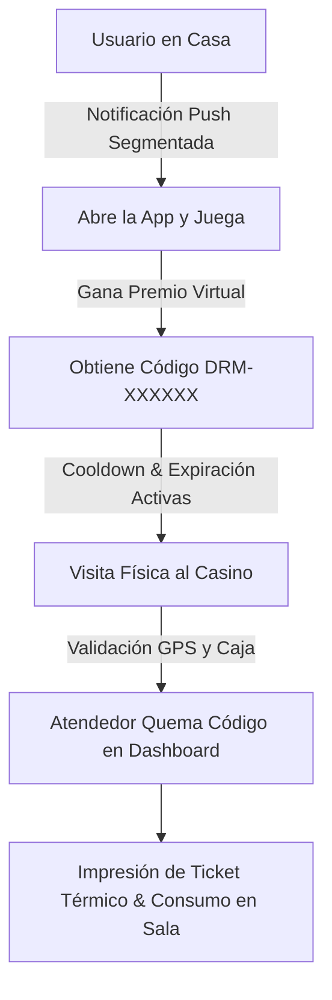

# 🎰 DreamsClub: Ecosistema Digital de Fidelización y Gamificación

Este documento detalla el funcionamiento del ecosistema **DreamsClub** (App Móvil y Dashboard Administrativo) y cómo está estructurado para maximizar la **retención**, la **gamificación** y la **re-visita física** de los clientes a las salas de Casinos Dreams.

---

## 📌 1. ¿Qué es DreamsClub?

**DreamsClub** es una plataforma integral diseñada para transformar la experiencia de los socios de la cadena **Casinos Dreams** (con presencia en 8 sedes a lo largo de Chile). El ecosistema conecta de manera bidireccional el juego virtual y la diversión en el dispositivo móvil con incentivos concretos de consumo y visitas en el casino físico.

### Componentes del Ecosistema:
1. **DreamsClub App (Flutter):** La aplicación móvil del socio. Concentra cartelera de espectáculos, minijuegos diarios, billetera de premios ganados y el registro de racha presencial.
2. **Dreams App (identidad pública de descarga):** El nombre visible y descargable para usuarios finales es **DreamsApp**. El APK público se entrega con formato `DreamsApp-vX.Y.Z.apk` desde un GitHub Release oficial para mantener la descarga limpia, verificable y compatible con la restricción de Firebase Hosting sobre archivos ejecutables.
3. **Dreams Admin (Astro):** El panel de control central para la administración. Desde aquí se editan los posts del feed, se crean premios dinámicos, se configuran las reglas de los juegos y se realiza el cobro (quemado) de cupones con impresión de tickets en caja.
4. **Servicios de Nube (Firebase):** Sincronización en tiempo real mediante Firestore, autenticación y notificaciones push masivas o segmentadas por Firebase Cloud Messaging (FCM).

---

## 🔄 2. ¿Cómo fomenta la Re-visita Física al Casino?

El principal objetivo de la aplicación no es retener al usuario de manera indefinida en la pantalla, sino **actuar como un imán para dirigir el tráfico hacia la sala de juegos física**. Esto se logra mediante las siguientes mecánicas clave:

### A. Geolocalización por GPS para el Registro de Rachas
* **Check-in Físico:** El módulo de **Racha Presencial** premia a los usuarios por asistir días consecutivos al casino.
* **Geocercas de Validación:** El dispositivo móvil utiliza permisos de ubicación precisa (`ACCESS_FINE_LOCATION`). La app valida por GPS que las coordenadas del usuario se correspondan con la sede asignada (ej. Dreams Coyhaique: `-45.57081, -72.07419`).
* **Incentivo:** Mantener o incrementar la racha desbloquea paquetes de stickers personalizados y estéticas/colores especiales dentro de la aplicación móvil.

### B. Motor Dinámico de Premios con Canje Físico Obligatorio
* **Catálogo Editable de Premios:** El administrador crea y modifica en tiempo real los premios en el dashboard web. Los premios típicos incluyen:
  * 1 Trago de Cortesía 🍸
  * \$3.000 en Créditos Promocionales 🎰
  * 1 Entrada Gratis al Casino 🎟️
  * 1 Sandwich Gourmet / Cerveza artesanal 🍔
* **Validez Temporal (Urgencia):** Cada premio ganado tiene una fecha de expiración automática (configurable, por ejemplo, 7 días). El usuario tiene una ventana limitada de tiempo para ir físicamente a cobrarlo antes de que expire.
* **Billetera Móvil y Código Único:** Al ganar, la app genera un código alfanumérico único e infalsificable (ej: `DRM-7K9A2X`) y un código QR asociado en la **Billetera de Premios (My Prizes)**.
* **Distribución Oficial del APK:** La descarga pública se entrega como `DreamsApp-v1.0.9.apk` desde GitHub Releases, con nombre profesional claro para usuarios finales y sin depender de Firebase Hosting, que bloquea archivos ejecutables en el plan gratuito. **Regla operativa:** no se volverá a subir la aplicación a Firebase Hosting para la distribución; la entrega será siempre por GitHub Releases para evitar errores de despliegue y versiones inconsistentes.

### C. Portal de Canje en Caja con Impresión de Tickets
* **Validación en Tiempo Real:** En el casino físico, el socio muestra su pantalla con el código o QR al personal (cajero, barman o atendedor).
* **Quemado en Dashboard:** El atendedor ingresa el código único en la sección `/canje` de **Dreams Admin** para buscarlo en Firestore.
* **Impresión de Ticket Físico:** Al hacer clic en "Validar y Quemar Premio", el sistema marca el cupón como cobrado (`status: 'cobrado'`) en menos de $100\text{ ms}$ y genera un modal optimizado para **impresoras térmicas de tickets (80mm)**. El atendedor imprime el comprobante físico que el socio entrega en barra o máquinas para consumir su premio.

### D. Reglas de Disponibilidad, Cooldowns y Límites Diarios
Para evitar el abuso del sistema y planificar las horas de mayor tráfico, el panel web permite administrar las reglas globales de los minijuegos en tiempo real:
* **Límite de Juegos Diarios (`maxDailyGamesAllowed`):** Define cuántos minijuegos distintos puede jugar el usuario al día (1, 2, 3 o los 4 sin límites). La app bloquea dinámicamente los juegos no jugados cuando se alcanza el límite diario.
* **Cooldown de 48 horas:** Restringe que los usuarios solo puedan ganar un premio físico del catálogo cada 48 horas a través de los minijuegos.
* **Días Específicos:** Habilitación de premios solo en días de baja afluencia (ej. lunes, martes y miércoles) o días de eventos especiales.
* **Ventana Horaria:** Rangos de hora específicos donde los premios están disponibles en los juegos (ej. de 18:00 a 23:00 hrs).

### E. Notificaciones Push Personalizadas y Segmentadas
* **Recuperación de Usuarios Inactivos:** En el dashboard de administración, el staff puede enviar notificaciones push personalizadas con filtros avanzados de audiencia: por **racha** (Inicial/Austral/Leyenda/Maestro/VIP), **asistencia** (presente hoy / inactivo 5d / 10d), **edad**, **cumpleaños del día** y **premios sin cobrar**.
* **Plantillas Dinámicas Todo-en-Uno:** Los mensajes soportan las claves `{name}` (nombre real del socio) y `{pending_prize}` (nombre real del premio pendiente). Al activar el filtro "Con premios sin cobrar", el formulario se auto-completa con una plantilla lista para editar. La API del servidor resuelve y personaliza cada push de forma individual antes de enviarlo.
* **Campañas Automáticas Diarias:** Se ejecutan tareas programadas diariamente que envían automáticamente felicitaciones de cumpleaños y recordatorios a socios con premios próximos a vencer, sin intervención manual del administrador.
* **Detalle Personalizado en App:** Al abrir una notificación desde la app, la pantalla de detalle resuelve las claves dinámicamente mostrando el nombre del socio y su premio real (o nada, si no tiene premios pendientes).

---

## 📱 3. Características Clave de la App Móvil (Flutter)

* **Feed Social Estilo Reels Inmersivo:** Scroll vertical de alto rendimiento con carga instantánea y reproducción de videos a pantalla completa (videos verticales en 100% de pantalla, y horizontales con letterbox). Cuenta con barra de acciones lateral derecha (Me gusta con Lottie animado, comentarios, compartir nativo, enlaces y vinilo de audio girando), barra inferior de comentarios flotante, y apertura de comentarios en Bottom Sheet (70% de pantalla) para no interrumpir la reproducción activa del fondo.
* **Identidad pública de la APP:** El nombre visible para el usuario final se presenta como **DreamsApp**, reforzando credibilidad y claridad en la descarga, la web de compartir y el proceso de instalación desde el GitHub Release oficial.
* **No usar Firebase Hosting para distribuir el APK:** Esta decisión queda explícita como política: la app no se sube ni se distribuye desde Firebase Hosting para evitar volver a cometer el mismo error y mantener una canalización de descarga limpia, segura y verificable.
* **Gamificación Centralizada:** Pestaña interactiva de minijuegos:
  * **Ruleta de la Suerte (Spin Wheel):** Animación física de rueda con detención aleatoria y sincronización de estado de premio.
  * **Slot Machine (Tragamonedas VIP):** Tres rodillos giratorios que buscan combinaciones ganadoras para otorgar premios del catálogo físico.
  * **Dreams Match & Dreams Mania:** Minijuegos casuales de habilidad y memoria de gemas y cartas que otorgan premios físicos directos según las reglas de disponibilidad configuradas en el panel web.
* **Billetera de Premios Offline-First:** Persistencia en caché local mediante `SharedPreferences` para mostrar cupones ganados instantáneamente incluso si el socio no tiene señal móvil dentro de la barra del casino.
* **Foto de Perfil Sincronizada en la Nube:** Los socios pueden personalizar su foto de perfil desde Ajustes. La imagen se sube a Firebase Storage y la URL permanente se guarda en Firestore, garantizando que la foto aparezca correctamente en cualquier dispositivo donde el socio inicie sesión.
* **Reacciones Reactivas desde Links Directos:** Al acceder a una publicación desde un link compartido, el botón de "Me gusta" refleja el estado real de reacción del usuario sin necesidad de navegar primero al feed principal.
* **Desbloqueo de Temas y Estilos por Racha:** La interfaz cambia dinámicamente de apariencia (colores de la racha y logo personalizado) al acumular visitas presenciales seguidas.

---

## 🌐 4. Características del Panel de Administración (Astro)

* **Dashboard Analítico:** Métricas rápidas de usuarios activos, premios entregados hoy, tasa de redención física y estado de los minijuegos.
* **Gestor del Feed:** Panel de creación de contenido multimedia donde los operadores suben videos promocionales directamente.
* **Creador de Reglas Dinámicas:** Formulario interactivo para cambiar la probabilidad de ganancia, cooldowns, límite de juegos diarios (`maxDailyGamesAllowed`) y días autorizados del casino sin requerir actualizaciones de la App en las tiendas.
* **Validador de Caja Avanzado:** Caja de texto con autocompletado y lectura de código para buscar registros de cupones rápidamente, mostrando el nombre del cliente, su RUT, correo, casino de origen (resolviendo Coyhaique de forma correcta), fecha de obtención y estado del premio.

---

---

## 🔒 5. Seguridad y Blindaje de Datos (Anti-Hackeo)

Para garantizar la integridad de las promociones y evitar que usuarios maliciosos alteren sus rachas, puntos o cobren premios inexistentes, el ecosistema cuenta con un doble blindaje de seguridad:

### A. Reglas de Acceso en Firebase (Firestore & Storage Rules)
* **Control de Modificación del Perfil:** Los usuarios sólo pueden modificar sus propios documentos y campos permitidos (ej. racha y casino favorito). Tienen prohibido alterar el campo `isAdmin`, previniendo que se auto-otorguen privilegios de administrador.
* **Integridad de Premios Ganados (`user_prizes`):**
  * **Creación Controlada:** Un usuario autenticado solo puede *crear* registros de premios asociados a su propio identificador.
  * **Bloqueo de Modificación:** Los usuarios no pueden editar ni eliminar sus cupones (no pueden marcar un cupón cobrado como "disponible" de nuevo).
  * **Autorización en Caja:** El cambio de estado a `cobrado` o `redeemed: true` está restringido exclusivamente a usuarios administradores (`isAdmin == true` en Firestore) o personal de caja autorizado.
* **Seguridad de Archivos y Medios:** Las publicaciones, catálogos e imágenes en Firebase Storage sólo pueden ser modificados por personal de Casinos Dreams, impidiendo la inyección de contenidos externos.

### B. Ofuscación de Código (Hardening del APK Android)
* **Compilación Segura (R8 / ProGuard):** Activación de ofuscación de código (`isMinifyEnabled = true`) y depuración de recursos huérfanos (`isShrinkResources = true`) en la compilación de producción de Android.
* **Ingeniería Inversa Bloqueada:** Las clases, variables, métodos y referencias de las APIs de Firebase quedan cifradas y ofuscadas, dificultando significativamente la decompilación del APK o la extracción de credenciales críticas.

---

## 📈 6. Métricas de Éxito de la Estrategia

El éxito del ecosistema digital se mide directamente en función de la actividad en sala:
1. **Redemption Rate (Tasa de Canje):** Porcentaje de premios virtuales que efectivamente se convierten en tickets térmicos impresos en la caja física del casino.
2. **Frecuencia de Retorno (Rachas):** Incremento de días consecutivos de visitas validadas por GPS por usuario.
3. **Eficiencia en Notificaciones:** Tasa de conversión de usuarios inactivos que regresan a la aplicación y posteriormente a la sala tras recibir una notificación segmentada.
